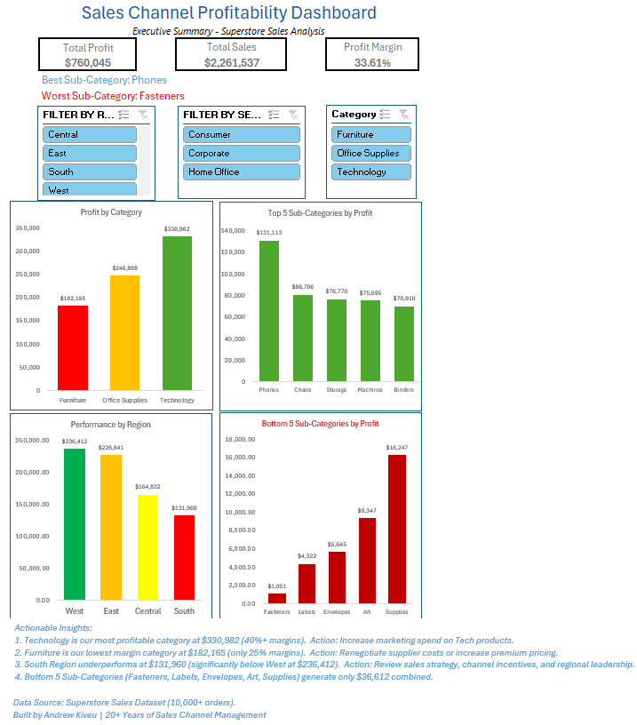

# Sales Channel Profitability Diagnostic

## 📊 Dashboard Preview

---

## 📋 Business Problem
As a Channel Manager with **20 years of experience**, I often saw high sales volumes hiding terrible profit margins. 

High sales numbers don't always mean high profits. This dashboard helps sales leaders quickly identify where the "leaks" are in their sales funnel—by category, sub-category, and region.

---

## 🛠️ Tools Used

| Tool | Purpose |
|------|---------|
| **Excel Power Query** | Data cleaning and transformation |
| **Excel Power Pivot** | Data modeling and DAX measures |
| **DAX** | Custom calculations for profit metrics |
| **Excel Slicers** | Interactive filtering by Region and Segment |

---

## 🔍 Key Findings

| Finding | Insight | Action |
|---------|---------|--------|
| **Technology** is most profitable | $330,982 in profit (40%+ margins) | ✅ Increase marketing spend on Tech products |
| **Furniture** has lowest margins | $182,165 in profit (only 25% margins) | ⚠️ Renegotiate supplier costs |
| **South Region** underperforms | $131,960 vs West at $236,412 | 🔄 Review sales strategy and incentives |
| **Bottom 5 Sub-Categories** generate only $36,612 combined | Fasteners, Labels, Envelopes, Art, Supplies | 📦 Consider bundling or discontinuing |

---

## 📈 Dashboard Features

- **Interactive slicers** – Filter by Region, Segment, and Category
- **KPI cards** – Total Profit, Total Sales, Profit Margin %
- **Profit by Category** – See which product categories drive profit
- **Top 5 Sub-Categories** – Identify your best performers
- **Bottom 5 Sub-Categories** – Identify your loss leaders
- **Performance by Region** – Compare regional performance

---

## 📂 Files in This Repository

| File | Description |
|------|-------------|
| `Superstore_Raw.csv` | Original Superstore sales dataset (10,000+ orders) |
| `Sales_Channel_Dashboard.xlsx` | Interactive Excel dashboard with Power Query, Power Pivot, and DAX |
| `Dashboard_Screenshot.png` | Preview image of the dashboard |

---

## 📊 Dashboard at a Glance

---

## 💡 Why This Matters

> *"A 20-year sales leader who can analyze data is more valuable than a junior analyst who can only run queries."*

---

## 🔜 Next Steps

- **SQL** – Write queries to validate these findings on a full database
- **Power BI** – Build a real-time version for live reporting
- **Python** – Automate the data extraction and transformation

---

## 📬 Connect With Me

- **LinkedIn**: www.linkedin.com/in/kiveuandrew
- **Email**: Kiveuandrew@gmail.com
---

*Created by Andrew Kiveu | 20+ Years Sales Channel Management*
